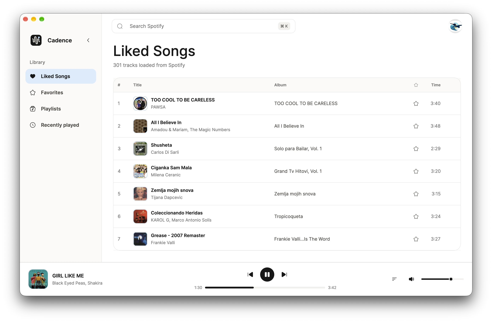

<p align="center">
  
</p>

<h1 align="center">Cadence</h1>

<p align="center">
  A minimal Spotify player for macOS.<br>
  Native, responsive, and typically uses around 120 MB of RAM.
</p>

<p align="center">
  <a href="https://github.com/infomiho/cadence/actions/workflows/ci.yml"></a>
  <a href="LICENSE"></a>
</p>



## Features

- Search tracks and playlists
- Play music locally with queue, history, favorites, and radio
- Browse native artist and album pages
- Light, dark, and system appearances
- Persistent playback and library state

## Built With

**Rust** + **GPUI** + **librespot** + **rspotify** + **SQLite** + **SDL2**

GPUI renders the native GPU-accelerated interface, librespot handles playback,
rspotify connects to the Spotify Web API, and SQLite keeps local state.

## Set Up Spotify

Cadence requires macOS and Spotify Premium. On first launch, Cadence guides you
through creating a Spotify developer app and entering its Client ID. Client IDs
are public; Cadence never needs your client secret.

1. Create an app in the [Spotify Developer Dashboard](https://developer.spotify.com/dashboard).
2. Add `http://127.0.0.1:8888/callback` as a redirect URI.
3. Copy the Client ID from **Basic Information** and enter it in Cadence.

Cadence stores the Client ID in app preferences and keeps login and playback
tokens in macOS Keychain.

## Run From Source

Building Cadence requires Rust and Apple's Metal Toolchain. Developers can skip
the setup screen by setting `SPOTIFY_CLIENT_ID` at launch:

```sh
SPOTIFY_CLIENT_ID="your-client-id" cargo run
```

For a stable local signature and fewer Keychain prompts during development:

```sh
SPOTIFY_CLIENT_ID="your-client-id" ./scripts/run-signed.sh
```

## Releases

Version tags publish an optimized macOS app and SHA-256 checksum on the
[releases page](https://github.com/infomiho/cadence/releases). Current builds
use an ad-hoc signature and are not notarized, so macOS may require using
**Open** from the app's context menu on first launch.

Release builds do not include a shared Spotify Client ID. Each person configures
their own Spotify developer app on first launch. The logo attribution is in
[`THIRD_PARTY_NOTICES.md`](THIRD_PARTY_NOTICES.md).

## License

[MIT](LICENSE)
